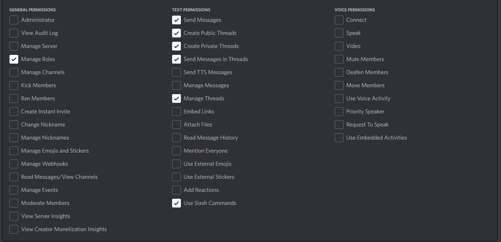

# todo

- ~~Better interfacing between slashcommands -> handlers -> db (now its a bit messy)~~
- ~~/cancel instead of /result 0 0   (in case someone is not here)~~
- /result reserved to people in the match only (probably reserved to loosing team too)
- /result integer checking for winning state ( score between teams >=2)
- better matchmaking algorithms (now it takes 6 players randomly in the pool, and is often first come first serve since it's matching every 15 secs)
- /autojoin (rejoin queue after match if match was not canceled)
- Pinned message on dedicated channel with howto use bot
- ~~rating update (elo based)~~
- rating based matchmaking
- rematch ?
- /swap 
- update bot permission link in this file
- Automatically leave queue after a time (1h?). Probably tag the person who was forced out. Add queue time into match quality calculations. 
- Match predictions. Disallow people playing in a match from predicting.
- Currency system. Get currency from winning (more, 20?), losing (less, 10?) and predicting correctly (5?). Pay with currency for @ Ai.Mi (20).
- Punish dodging people in some way (reduce match priority by reducing quality of matches with dodging players?)
# bot permissions on discord dev portal

url : https://discord.com/api/oauth2/authorize?client_id={clientid}&permissions=397552912384&scope=applications.commands%20bot
