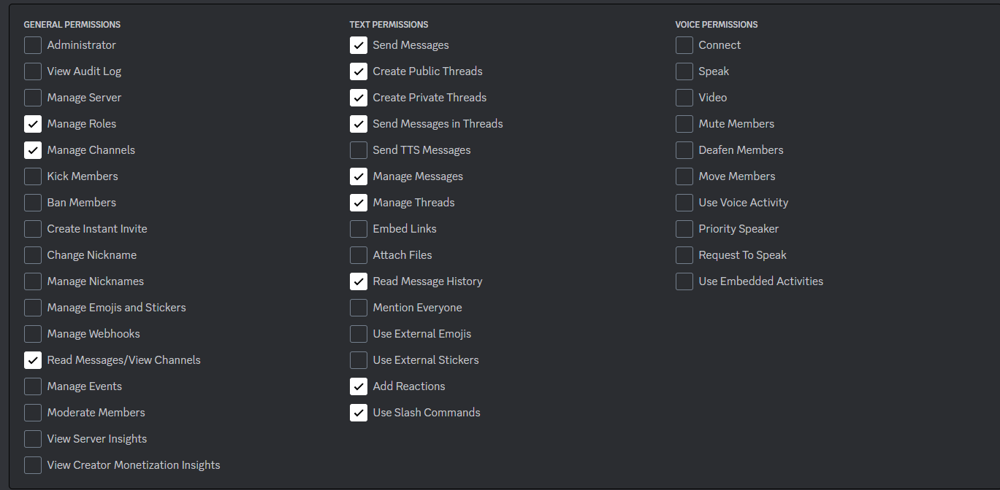

# todo

- first check commands before adding it (use a flag to force update)
- Punish dodging people in some way (reduce match priority by reducing quality of matches with dodging players?)
- /autojoin (rejoin queue after match if match was not canceled)
- improve messages fetching (goroutine per channel ?), keep messages log and try to built missing from there instead of restarting from scratch
- chat message improvements (using neural instead of markov to be able to get contextual informations ?)
- /givecredits @user 100 for mods
- better prod tools (restarting, log access)

# bot permissions on discord dev portal

url : https://discord.com/api/oauth2/authorize?client_id={clientid}&permissions=397552920592&scope=applications.commands%20bot

# features

- Chat response using markov chains

- matchmaking (supporting predictions)

- discord role based on in game rank

# Getting started

## requirements
- Go 1.20+
- Latest NodeJS LTS (18.x)
- GCC compiler for sqlite (https://jmeubank.github.io/tdm-gcc/ on windows | should be available on linux/macos by default)
- Docker for mysql (if not using sqlite or vice versa)

## letsgo
- clone the repo
- run `cd web && npm run install && npm run build`
- fill and rename .env.sampe to .env (to get tokens, you'll need to declare applications on discord and twitch dev portals)
- invite the bot to your discord server (replace {clientID} with your own): https://discord.com/api/oauth2/authorize?client_id={clientid}&permissions=397552920592&scope=applications.commands%20bot
- run the server : `go run webserver/main.go`
- access the web page via localhost:9000
- you can also live edit the web page using `npm run start` in the web folder, it will proxy the request to the go server (access via localhost:5173)